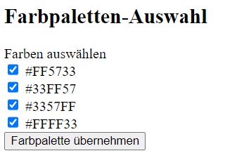

# Pflichtenheft für das Projekt PixelTiler

| **Dokument**              | **Pflichtenheft: PixelTiler**                                     |
| ------------------------- | ----------------------------------------------------------------- |
| **Ersteller**             | Elias Guerematchi-Vrabl                                           |
| **Firma/Abteilung**       | Wien Digital - MA 01                                              |
| **Projektname**           | PixelTiler                                                        |
| **Projektbeschreibung**   | Erstellung einer Website zur Generierung von Mosaiken aus Bildern |
| **Version**               | 1.0                                                               |
| **Erstelldatum**          | 20.09.2024                                                        |
| **Letzte Aktualisierung** | 20.09.2024                                                        |

<div style="page-break-after: always;"></div>

## 1. Projektübersicht

**Zweck**: Entwicklung einer Website, auf der Benutzer Bilder hochladen und diese in ein Mosaik umwandeln können.

**Wichtiger Hinweis**: Alle in diesem Projekt verwendeten Steuerelemente sind standardmäßige HTML-Formularelemente wie Buttons, Drop-down-Menüs, Eingabefelder und Radio-Buttons.

**Hauptziele**:

- Ermöglichung des Uploads von Bildern.
- Umwandlung der Bilder in individuell angepasste Mosaikbilder.
- Herunterladen vom „Plan“ als JSON-Datei.

## 2. Funktionalitäten und Benutzeranforderungen

### 2.1. Bild-Upload

- **Funktion**: Benutzer sollen in der Lage sein, Bilder von ihrem Computer hochzuladen.
- **Details**:
  - Unterstützte Dateitypen: .jpeg, .png, .webp
  - Maximale Dateigröße: 10 MB.
  - Validierung der Bildgröße und Anzeige einer Fehlermeldung bei Nichtbeachtung.

#### **Button**:


### 2.2. Mosaik-Konfiguration

#### 2.2.1. Mosaikgröße

- **Funktion**: Der Benutzer kann die Höhe und Breite des Mosaiks in Millimetern festlegen.
- **Details**:
  - Die Eingabe der Höhe und Breite erfolgt in ganzen Zahlen, wobei 1px = 1mm entspricht.
  - Es gibt eine Validierung, um sicherzustellen, dass die eingegebenen Werte im Format `xxx,xx` (drei Stellen vor und zwei Stellen nach dem Komma) eingegeben werden und innerhalb des zulässigen Bereichs liegen.

#### **Buttons**:


#### 2.2.2. Materialauswahl

- **Funktion**: Der Benutzer kann das Material des Mosaiks auswählen.
- **Details**:
  - Auswahlmöglichkeiten: Glas, Keramik oder Marmor.
  - Die verfügbaren Materialien und ihre Farbpaletten werden aus einer JSON-Datei geladen.
  - Auswahl erfolgt über ein Drop-down-Menü.

#### **Buttons**:


#### 2.2.3. Abstand zwischen den Steinen

- **Funktion**: Der Benutzer kann den Abstand zwischen den Mosaiksteinen in Millimetern festlegen.
- **Details**:
  - Benutzer kann den Abstand als Ganzzahl über ein Drop-down-Menü auswählen (z.B. 1mm, 2mm, 3mm, etc.).
  - Die Optionen werden ebenfalls aus der JSON-Datei geladen.

#### **Buttons**:


#### 2.2.4. Steingröße

- **Funktion**: Der Benutzer kann die Größe der Mosaiksteine auswählen.
- **Details**:
  - Die Steingröße wird in Millimetern definiert und hängt vom ausgewählten Material ab.
  - Die Größe wird über ein Drop-down-Menü gewählt. Die verfügbaren Größen (z.B. drei oder mehr für Glas) sind in der JSON-Datei definiert. Die Steingröße wird im Format `Breite x Höhe` (z.B. 3 x 3) angegeben.

#### **Buttons**:


### 2.3. Mosaik-Vorschau

- **Funktion**: Das Programm generiert eine Vorschau des Mosaikbildes basierend auf den eingegebenen Parametern.
- **Details**:
  - Zunächst wird das Bild mit den natürlichen Farben des hochgeladenen Bildes in Mosaikform dargestellt.
  - Die Vorschau wird direkt unter dem Eingabeformular angezeigt.
  - Möglichkeit zur erneuten Anpassung der Parameter und Generierung eines neuen Vorschau-Bildes.

#### **Buttons**:


### 2.4. Farbpaletten-Auswahl

- **Funktion**: Benutzer können eine Farbpalette für den endgültigen Plan auswählen.
- **Details**:
  - Eine Liste der Farben des ausgewählten Materials (Glas, Keramik oder Marmor) wird aus der JSON-Datei geladen und angezeigt.
  - Benutzer können per Radio-Button Farben auswählen, die Teil des Mosaiks sein sollen. Standardmäßig sind alle Farben aktiviert.
  - Farben, die deaktiviert werden, erscheinen ausgegraut und werden aus dem Plan entfernt.

#### **Buttons**:



### 2.5. Plan-Generierung und Download

- **Funktion**: Der Benutzer kann den endgültigen Mosaikplan herunterladen.
- **Details**:
  - Der Plan wird als 2D-JSON-Matrix gespeichert, in der für jede Position der Mosaiksteine die entsprechenden Hex-Codes der ausgewählten Farben enthalten sind.
  - Vor dem Download wird eine finale Vorschau des Mosaikplans angezeigt.
  - Die tatsächlichen Dimensionen des Mosaikbildes (Höhe und Breite) sowie die Größe der einzelnen Steine werden ebenfalls im JSON enthalten sein.

### **Beispiel JSON-Datei**:

```json
{
  "mosaicPlan": [
    ["#FF5733", "#33FF57", "#3357FF"],
    ["#FFFF33", "#FF33FF", "#33FFFF"],
    ["#5733FF", "#33FF57", "#FF5733"]
  ],
  "tileSize": {
    "width": "10mm",
    "height": "10mm"
  },
  "tileGap": "2mm",
  "materialType": "Glas",
  "dimensions": {
    "width": "300mm",
    "height": "200mm"
  }
}
```

- **mosaicPlan**: Ein zweidimensionales Array, das die hexadezimalen Farbcodes für die einzelnen Mosaiksteine speichert.

  - Jede Zeile des Arrays repräsentiert eine Zeile von Mosaiksteinen in der Vorschau.
  - Die Hex-Codes repräsentieren die Farben, die aus der Farbpalette ausgewählt wurden.

- **tileSize**: Die Größe der Mosaiksteine, im Format `Breite x Höhe`, wie vom Benutzer festgelegt.

- **tileGap**: Der Abstand zwischen den Mosaiksteinen, der ebenfalls über das Drop-down-Menü ausgewählt wurde.

- **materialType**: Das vom Benutzer ausgewählte Material (z.B. Glas, Keramik oder Marmor).

- **dimensions**: Die tatsächlichen Dimensionen des generierten Mosaiks (Breite und Höhe in Millimetern).

#### **Buttons**:


